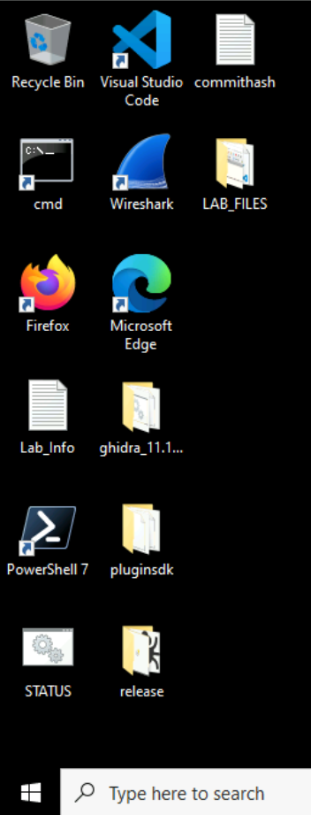

# Initial Setup

To begin, start your lab as we covered before this section.

Once the lab has started, launch the Windows VM.

Once the VM had loaded, it will take ~10 minutes for the files to appear on the desktop. Once everything is loaded in, you'll have the following on the desktop:

- `ghidra_11.1.1_PUBLIC` folder
- `pluginsdk` folder
- `release` folder (this is x64/32dbg)
- `LAB_FILES` folder

Your desktop should look similar to the following once fully loaded:

## Extracting Lab Files

Before we can begin, we need to extract our lab files. The process is simple:

1. On the Desktop, open the `LAB_FILES` folder

1. Locate the `RUN_ME_AS_ADMIN_FIRST.bat` script (the suffix will not be visible, so you'll just see `RUN_ME_AS_ADMIN_FIRST`)

1. Right-click on `RUN_ME_AS_ADMIN_FIRST` and select `Run as administrator`

- Select `Yes` on the UAC prompt

- This will disable Windows Defender, and stop it from interfering with our work

1. In the same `LAB_FILES` folder, double-click on `dc32_workshop_files-part1`. This is actually a `.zip` file.

1. Select both the `lb3builder_2024_08_08.gar` file and `LBLeak` folder and drag them to the desktop

- Once you drag the files to the desktop, Windows will prompt you for the zip archive password.

1. Enter the archive password: `dc32workshop`

1. Close the zip archive window to return to the Desktop

You should now have both the `lb3builder_2024_08_08.gar` file and `LBLeak` folder on your desktop. Once you have these, you are ready to begin!

# Ghidra Analysis

In this section, we're going to open and configure as required for the workshop.

1. Double-click the `ghidra_11.1.1_PUBLIC` folder on the desktop
1. Double-click the `ghidra_Run` .batch script in this folder
1. Choose `I Agree` to continue executing Ghidra
 - Once Ghidra opens, you'll be prompted with the `Tip of the Day` window
1. Click the `Close` button on the tips window to close it
1. Open the provided Ghidra project by choosing `File > Restore Project...`
    1. For the `Archive File`, navigate to `C:\Users\pslearner\Desktop\` and select the `lb3builder_2024_08_08.gar` project
1. Click `OK` to import the project
1. Double-click on the `builder.exe` file in the recently-opened project
1. Select the `Edit` menu and select `Tool Options`
1. From the left-hand nav menu, expand `Listing Fields`
1. Choose `Cursor text highlight` in this menu
1. Change the `Mouse button the activate` from `MIDDLE` -> `LEFT`
1. Press `OK` to save your settings

    The above steps walk you through opening the provided (and commented!) project and set the left-click option to highlight variables throughout the code.

## Begin Code Review

1. To begin code review, in the left-hand nav menu, find the `Symbol Tree` area, expand the `Exports` folder, and double-click on `entry`.

This will bring you to the entry point of the builder. We will now begin the code review.

## What Happens First?

1. Note that the `entry` function calls a function, which I've labeled `MainFunction`. Upon return of the function, `ExitProcess(0)` is called.

    When a function returns, the return value of `0` usually indicates success. So even if the overall builder fails, it returns a value of `0`, indicating to the OS that it returned successfully.
    
1. Let's begin review of the actual code. To do so, double-click on the `MainFunction` label to open the main function that does all the work.

## MainFunction Review

1. To begin our review, pay attention to the `Decompilation` window, to the right.
    
    Are we all on the same page, so to say? I will take Qs here to verify that the Decompilation window is showing for everyone. Please note that you can grab the window on the left-hand side to increase the screen real estate of the Decompilation window.

1. At `0x00403b39`, we see a call to `GetCommandLineW`, which will fetch the command line parameters for the process. This is a critical step in the builder, as the options for building are provided on the command line.

1. At `0x00403b8e` we begin looping through arguments.

1. At `0x00403bbc`, we see the `-pass` parameter being checked.

1. At `0x00403c89` the code checks if a config, public key, and outfile file have been provided.

1. At `0x00403cde` we call what I've labeled the `BuildEXE` function, which begins the building of an `.exe` file.

1. Double-click on `BuildEXE` to see what the function that builds the EXE does. This is where the fun starts.

## EXE Building

You should be at `BuildEXE`, which is at `0x00403204`.
    - If you're lost, simply press the `G` key, enter `0x00403204`, and hit enter. You will now be in lock-step with us.
    
1. At `0x00403257`, the config file is read from disk.

1. At `0x00403287`, the public key file is read from disk.
    - Please note that both the config and key file have been created/set prior to the lab.

## Pulling the Template from Resources
    
1. At `0x0040342a`, `GetModuleHandleW` is called with a parameter of `0x0`, which mean sit will returns the module handle to the current process -- i.e. the builder itself

1. At `0x00403463`, the EXE template from resource 101 is loaded (65 in decimal).

1. At `0x00403469`, the resource pulled is "locked", which really just means a pointer to it is built.

1. At `0x004034bc`, the resource pulled, which is the EXE encryptor, is copied into a newly-created buffer.

1. At `0x004034da`, the EXE is memory is encoded.

1. At `0x004034f3`, GeneratePasscode() is called.

    Double click this address to enter the function where the fun passcode stuff occurs.

## Generating the Passcode    

1. At `0x0040273a`, CreatePasscode() is called. When this returns, the passcode will be in the array argument passed to the function.

    From here, multiple levels of processing occur. We will not have time to delve into these further.
    
## Writing Files

1. At `0x00403523`, the output file string is built.

1. At `0x00403543`, the passcode file string is built.

1. At `0x00403582`, the WriteFiles() function is called. This call creates the passcode file.

1. At `0x004035b4`, the WriteFiles() function is called again. This call creates the ransomware binary itself.

# x32dbg Analysis

Let's debug this bad boy!!

## Configuring the Debugger

We'll now debug the builder in `x32dbg` in order to follow some of the fun things it does when writing the ransomware binary.

To begin:

1. Double-click the `release` folder on the desktop.

1. Double-click the `x32` folder.

1. Double-click `x32dbg.exe` to execute it.

1. Maximize the window to full screen mode.

1. Choose `File -> Open` and select `C:\Users\pslearner\Desktop\LBLeak\builder.exe`

1. Choose `File -> Change Command Line`.

    Once the dialogue box opens, enter the following into the field. Clear out everything first, then paste this in:
    
    `"C:\Users\LegitUser\Desktop\LBLeak\builder.exe" -type enc -exe -pass -pubkey pub.key -config config.json -ofile LB3-dc32.exe`
    
    The above tells the debugger to use the provided arguments with the builder:
    
    1. `-type enc`: We're going to create an encryptor.
    
    1. `-exe`: We're going to create an EXE (not a DLL).
    
    1. `-pass`: We're going to generate a passcode required to run the compiled ransomware binary.
    
    1. `-pubkey pub.key`: We're going to use a pre-generate key called `pub.key`
    
    1. `-config config.json`: We're going to use the `config.json` configuratoin file.
    
    1. `-ofile LB3-dc32.exe`: We're going to output the compiled ransomware binary using the name `LB3-dc32.exe`.
    
## Import x32bg Database

Rather than set breakpoints manually, since we won't have much time to do this in class, we have pre-set breakpoints. To load them, you will want to load the x32bg database for the `builder.exe` app. You can do so by:

1. Choose `File -> Database -> Import database`.

    Select `C:\Users\pslearner\Desktop\LBLeak\builder.dd32` and hit `Open`.
    
    We've now imported our database for `builder.exe`, which should include all of our pre-configured breakpoints.
    
Now let's check that our breakpoints are in order.

1. Choose `View -> Breakpoints` (or hit `Alt + B`).

You should see the following:

If your breakpoints look like the above, great! If not, whoops!

1. Choose `View -> CPU` (or hit `Alt + C`).

You should be back in the debugger window looking at the code we want to debug.

## OPTIONAL: Set Breakpoints Manually

We will _not_ be doing this during the workshop. BUT, if you wanted to set the breakpoints yourself, you could use the following instructions :).

Now that we've set up the debugger, we need to set our breakpoints for analysis.

1. Press `Ctrl + G` to open the `Enter expression to follow` window.

    In the window, enter `4034BC` and hit enter.

1. Press `F2` to set a breakpoint

    We have now set our first breakpoint. We will continue this process for the remaining breakpoints.
    
    The breakpoint we have just set is for the call to `memcpy`, where the EXE resource is written into a newly-created buffer.

1. Press `Ctrl + G` to open the `Enter expression to follow` window.

    In the window, enter `4034da` and hit enter.

1. Press `F2` to set a breakpoint

    The breakpoint we have just set is for the call to the function that obfuscates the template loaded into memory.

1. Press `Ctrl + G` to open the `Enter expression to follow` window.

    In the window, enter `4034F3` and hit enter.

1. Press `F2` to set a breakpoint

    The breakpoint we have just set is for the call to `GeneratePasscode()`, which is the function master function that takes care of passcode generation.

1. Press `Ctrl + G` to open the `Enter expression to follow` window.

    In the window, enter `40273A` and hit enter.

1. Press `F2` to set a breakpoint

    The breakpoint we have just set is for the call to `DERP()`, which generates the actual passcode that will be used.

1. Press `Ctrl + G` to open the `Enter expression to follow` window.

    In the window, enter `4034F3` and hit enter.

1. Press `F2` to set a breakpoint

    The breakpoint we have just set is for the call to `GeneratePasscode()`, which is the function master function that takes care of passcode generation.

1. Press `Ctrl + G` to open the `Enter expression to follow` window.

    In the window, enter `403523` and hit enter.

1. Press `F2` to set a breakpoint

    The breakpoint we have just set is for the call to the function that builds the output file string.
    
1. Press `Ctrl + G` to open the `Enter expression to follow` window.

    In the window, enter `403543` and hit enter.

1. Press `F2` to set a breakpoint

    The breakpoint we have just set is for the call to the function that builds the passcode output file name.

1. Press `Ctrl + G` to open the `Enter expression to follow` window.

    In the window, enter `403582` and hit enter.

1. Press `F2` to set a breakpoint

    The breakpoint we have just set is for the call to the function that writes the passcode file to disk.

1. Press `Ctrl + G` to open the `Enter expression to follow` window.

    In the window, enter `4035b4` and hit enter.

1. Press `F2` to set a breakpoint

    The breakpoint we have just set is for the call to the function that writes the ransomware binary to disk.

All breakpoints have been set!

## Delete Pre-Existing Files

In Explorer, go to `C:\Users\LegitUser\Desktop\LBLeak\` and delete the following files if they exist:

1. `LB3-dc32.exe`

1. `LB3-dc32.exePassword_exe.txt`

Now that we are sure neither the compiled binary nor the password file exist on disk, let's begin our debugging.

## Begin Debugging

Now it's time to debug! Let's get to it!

1. Hit `F9`.

    The debugger will stop at our first breakpoint, `0x004034BC`.

1. Select the top of the stack, right-click, and choose `Follow DWORD in Dump -> Dump 1`.

    You will see that the bottom-left side of the screen now shows a bunch of zeroes. Your address will vary from everyone else's in the workshop, including mine, as the buffer that was created will be different on all machines.
    
    Keep your eye on the Dump section and then:
    
1. Hit `F8`.

    You will now notice an `MZ` header in the Dump window. This is because `memcpy` was just calld, and resource `101`/`0x65` (the EXE template) has now been written to the buffer.
    
    The builder has now pulled the raw template from the resources and written it to memory. Good start!
    
1. Hit `F9` to reach out next breakpoint.

    Keep your eye on the Dump section and then:
    
1. Hit `F8` to step over the function call.

    You'll notice that the EXE template has now been replaced.
    
1. Hit `F9` to hit our next breakpoint.

1. Hit `F7` to enter the `GeneratePasscode()` function.

1. Hit `F9` to hit our next breakpoint.

    This is where the passcode will be generated.

1. Hit `F8` to step over the passcode-generating function.

    Look two lines above. There's our generated passcode!
    
    Your passcode will differ from everyone else's in the class. This is because the random seed that was generated to produce this passcode was pseudo-generated based on machine statistics from your VM.
    
1. Hit `F9` to hit our next breakpoint.

    This is where the output filename is built.
    
1. Hit `F8` to step over the filename-building function.

    Look two lines down. You'll see the string `LB3-dc32.exe`. This will be the final payload filename.
    
1. Hit `F9` to hit our next breakpoint.

    This is where the passcode filename is built.
    
1. Hit `F8` to step over the passcode name building function.

    Look two lines up. You'll see the string `LB3-dc32.exePassword_exe.txt`. This will be the name of the passcode file that will be written to disk.

1. Hit `F9` to hit our next breakpoint.

    This is where the passcode file is written to disk.
    
1. Hit `F8` to step over the passcode file writing function.

    Once you've stepped over this function, check the `C:\Users\LegitUser\Desktop\LBLeak\` folder. You will now see a passcode will with the name `LB3-dc32.exePassword_exe.txt`. Open this file in Notepad++.
    
    We will review this file as a group.
    
1. Go back to x32dbg and hit `F9` to hit our next breakpoint.

    This is where the ransomware binary is written to disk.

1. Hit `F8` to step over the ransomware payload file writing function.

    Once you've stepped over this function, check the `C:\Users\LegitUser\Desktop\LBLeak\` folder. You will now see that the builder has created the ransomware binary.
    
That's it! We've walked through the building process and have witnessed both the passcode and ransomware binary files being written to disk.

1. Close `x32dbg`. The debugger will shut down and you will now be prepared for round 2 of the workshop.

BOOM! We have completed part 1 of the workshop!
::: sigh of relief :::
